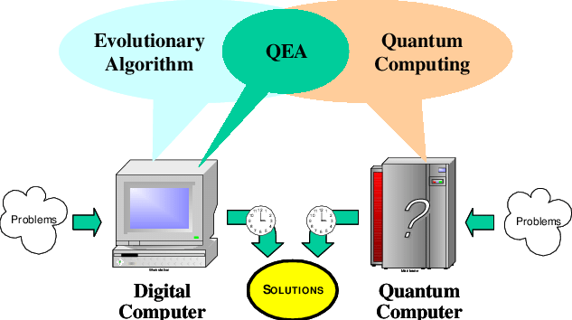
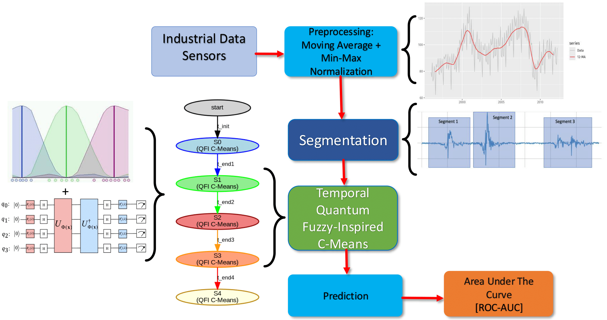

# 🧠 Timed Quantum-Fuzzy Inspired Fault Detection in Industrial Scenarios

This repository contains the complete implementation of a novel anomaly detection framework for industrial multivariate time series, integrating:

- ⏱️ **Timed Automata** for temporal segmentation  
- 🌌 **Quantum-Inspired Fidelity-Based Fuzzy Clustering**  
- 🧪 **Unsupervised Learning with One-Class Setup**

---
<div align="center">
  
</div>
<div align="center">
  
</div>

## 📂 Repository Structure

| File | Description |
|------|-------------|
| `quantum_ispired_fuzzycmeans.ipynb` | Full pipeline including training, inference, temporal segmentation with change point detection, and fuzzy clustering with quantum-inspired fidelity metric |
| `Quantum-inspired-evolutionary-algorithm-QEA.png` | Illustrative diagram of the quantum-inspired clustering process |
| `requirements.txt` | Python dependencies needed to run the notebook |

---

## 🧩 Method Overview

Industrial environments generate noisy and high-frequency multivariate time series. Traditional models often fail to detect early or subtle faults due to nonlinearity, noise, and changing regimes.

This project introduces the **first anomaly detection framework** that combines:

- **Change Point Detection** to segment the signal into statistically homogeneous intervals
- **Timed Automata** to represent and navigate those intervals as temporal states
- **Fuzzy Clustering** with a **quantum fidelity-based distance** to capture nonlinearities and provide interpretable anomaly scores

Each segment (state) is modeled by a **dedicated anomaly detection model** trained only on normal data from that regime (one-class paradigm). The inference stage dynamically selects the correct model based on the current automaton state.

---

## 🛠️ How to Run

Due to the **computational cost** of segmentation and fuzzy model training:

✅ We recommend running `quantum_ispired_fuzzycmeans.ipynb` as a standalone Python script using `screen` or `tmux`:

```bash
# Optional: Create virtual environment
python3 -m venv venv
source venv/bin/activate
pip install -r requirements.txt

# Convert and run as script
jupyter nbconvert --to script quantum_ispired_fuzzycmeans.ipynb
python3 quantum_ispired_fuzzycmeans.py
